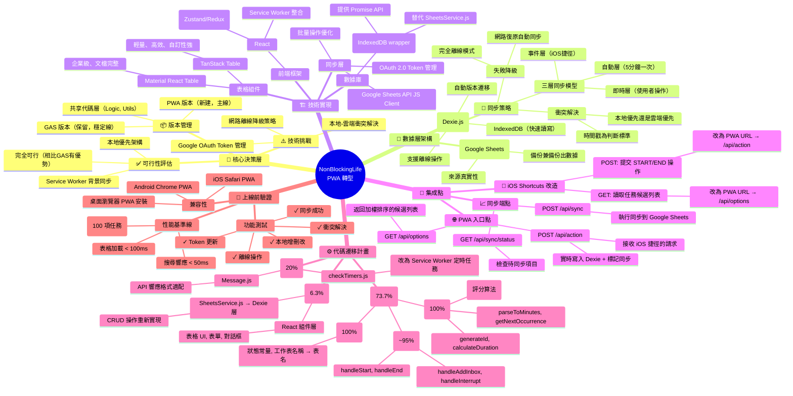

# NonBlockingLife PWA 轉型 Mind Map

```mermaid
mindmap
  root((NonBlockingLife<br/>PWA 轉型))
    🎯 核心決策層
      ✅ 可行性評估
        完全可行（相比GAS有優勢）
        本地優先架構
        Service Worker 背景同步
      ⚠️ 技術挑戰
        Google OAuth Token 管理
        本地-雲端衝突解決
        網路離線降級策略
      📦 版本管理
        GAS 版本（保留，穩定線）
        PWA 版本（新建，主線）
        共享代碼層（Logic, Utils）
    
    💾 數據層架構
      📱 本地存儲 (Dexie.js)
        IndexedDB（快速讀寫）
        支援離線操作
        自動版本遷移
      ☁️ 遠端存儲 (Google Sheets)
        來源真實性
        備份兼備份出數據
      🔄 同步策略
        三層同步模型
          即時層（使用者操作）
          自動層（5分鐘一次）
          事件層（iOS捷徑）
        衝突解決
          時間戳為判斷標準
          本地優先還是雲端優先
        失敗降級
          完全離線模式
          網路復原自動同步
    
    🏗️ 技術實現
      前端框架
        React
          State Management (Zustand/Redux)
          Service Worker 整合
      表格組件
        TanStack Table
          輕量、高效、自訂性強
        Material React Table
          企業級、文檔完整
      數據庫
        Dexie.js (IndexedDB wrapper)
          替代 SheetsService.js
          提供 Promise API
      同步層
        Google Sheets API JS Client
        OAuth 2.0 Token 管理
        批量操作優化
    
    🔗 集成點
      🍎 iOS Shortcuts 改造
        GET: 讀取任務候選列表
          改為 PWA URL → /api/options
        POST: 提交 START/END 操作
          改為 PWA URL → /api/action
      🌐 PWA 入口點
        POST /api/action
          接收 iOS 捷徑的請求
          實時寫入 Dexie + 標記同步
        GET /api/options
          返回加權排序的候選列表
      📈 同步端點
        GET /api/sync/status
          檢查待同步項目
        POST /api/sync
          執行同步到 Google Sheets
    
    ⚙️ 代碼遷移計畫
      ✅ 可直接移植 (73.7%)
        Logic.js (~95%)
          handleStart, handleEnd
          handleAddInbox, handleInterrupt
        Utils.js (100%)
          generateId, calculateDuration
          parseToMinutes, getNextOccurrence
          calculateCandidates (評分算法)
        Config.js (100%)
          狀態常量, 工作表名稱 → 表名
      ⚠️ 需要適配 (20%)
        Message.js
          API 響應格式適配
        checkTimers.js
          改為 Service Worker 定時任務
      ❌ 需重新實現 (6.3%)
        SheetsService.js → Dexie 層
          CRUD 操作重新實現
        React 組件層
          表格 UI, 表單, 對話框
    
    🚀 上線前驗證
      功能測試
        ✓ 本地增刪改
        ✓ 離線操作
        ✓ 同步成功
        ✓ 衝突解決
        ✓ Token 更新
      性能基準線
        表格加載 < 100ms
        搜尋響應 < 50ms
        同步耗時 < 2s (100 項任務)
      兼容性
        iOS Safari PWA
        Android Chrome PWA
        桌面瀏覽器 PWA 安裝
```
