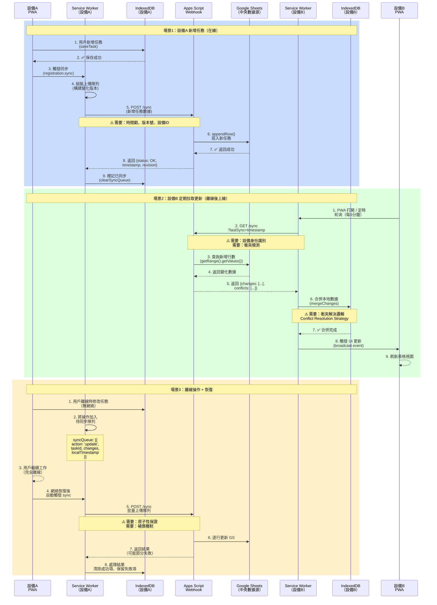
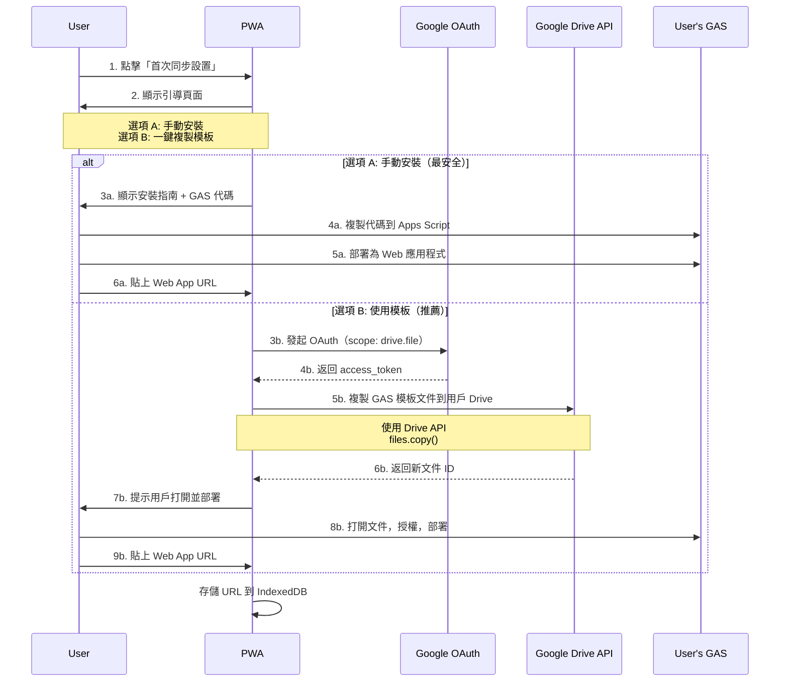

# 同步的問題

## [2026-03-06] ychsue 現在可以來做同步的部分了，這裡是希望當一位使用者在他的手機、平板、個人電腦等都使用此PWA，那麼，他們顯然就有同步的問題，我想到的是利用User的個人 Google Sheets，請問您有其他更好的辦法嗎？請注意，我沒有經費搭建Server 給使用者

## [2026-03-06] GitHub Copilot 的建議

### 推薦方案排行

#### 1️⃣ **Google Sheets API + Apps Script（推薦）**

你的提議很好。優點：

- ✅ 免費、無需額外付費
- ✅ 用戶已熟悉 Google 生態
- ✅ 內建權限管理和備份
- ✅ 支持離線操作（透過 Service Worker）
- ✅ 用戶可完全掌控數據（在他們的 Google Drive）

實現建議：

```typescript
// PWA 端：
- 使用 IndexedDB 做本地緩存
- Service Worker 同步隊列 (Background Sync API)
- Apps Script 作為簡單的 API gateway
- 定期/手動 sync 到 Google Sheets
```

副作用：Google API quota 限制（免費額度足夠個人使用）

---

#### 2️⃣ **Supabase（PostgreSQL + Realtime）**

免費方案相當寬鬆：

- ✅ 每月 500MB 存儲
- ✅ 500K API 請求
- ✅ Realtime subscriptions 支持
- ✅ 自動備份

缺點：

- ❌ 需要信任第三方平台
- ❌ 免費層有配額限制
- ❌ 冷啟動可能較慢

---

#### 3️⃣ **Firebase Realtime Database**

Google 旗下，可靠：

- ✅ 免費 1GB 存儲
- ✅ Realtime sync（雙向綁定）
- ✅ 離線支持

缺點：

- ❌ 超過限額需付費
- ❌ NoSQL 結構不如 SQL 靈活
- ❌ 隱私考量

---

#### 4️⃣ **純 PWA + IndexedDB（完全離線方案）**

適合需求簡單的情況：

```typescript
// 實現同步機制：
- 主設備設為「主控端」（手機）
- 其他設備通過 QR Code 配對
- 使用 Beacon API / periodic sync 上傳變化
- 用戶手動觸發同步
```

優點：

- ✅ 完全免費
- ✅ 零依賴第三方
- ✅ 用戶隱私最大化

缺點：

- ❌ 需要自己實現衝突解決（conflict resolution）
- ❌ 同步可靠性依賴網絡
- ❌ 無實時同步

---

### 混合方案（最實用）

#### **推薦組合：Google Sheets + IndexedDB**

```js
用戶設備 A ←→ IndexedDB + Service Worker
                    ↓ (定期 sync)
                Google Sheets (中央數據源)
                    ↑ (polling/拉取)
用戶設備 B ←→ IndexedDB + Service Worker
```

優勢：

1. 設備 A 和 B 都能離線工作
2. 打開 PWA 時自動拉取最新數據
3. 後台 Service Worker 定期同步
4. Google Sheets 作為備份和跨平台同步點
5. 零成本，且數據完全由用戶控制

---

### 實現優先級建議

1. **第一階段**：IndexedDB 本地存储 + 手動「上傳/下載」按鈕
2. **第二階段**：Background Sync API + Apps Script webhook
3. **第三階段**：轮询拉取更新（polling）
4. **未來**：Realtime sync（使用 Supabase 或自建）

---

### 技術細節補充

**Apps Script 端最簡單的實現**：

```javascript
// doPost 接收來自 PWA 的數據
function doPost(e) {
  const data = JSON.parse(e.postData.contents);
  // 寫入 Google Sheet
  const sheet = SpreadsheetApp.getActive().getSheetByName('Data');
  sheet.appendRow([...]);
  return ContentService.createTextOutput('OK');
}
```

**PWA 端**：

```typescript
// Service Worker 中
if ('serviceWorker' in navigator) {
  navigator.serviceWorker.ready.then(reg => {
    reg.sync.register('sync-to-sheets');
  });
}
```

---

### 結論

#### **最佳方案：採用你提議的 Google Sheets，加上 IndexedDB 本地緩存**

理由：

- 符合「無付費服務器」的要求
- Google Sheets 已是你專案的一部分
- 實現難度中等（你已有 Apps Script 經驗）
- 用戶體驗好（支持離線 + 跨設備同步）
- 可靠性高（Google 的基礎設施）

需要我進一步幫助設計同步機制或 Apps Script 的具體實現嗎？

===============================================================

---

## [2026-03-06] ychsue 那麼，可否請您寫出 mermaid sequence diagram ，然後分析我們還少甚麼嗎？

## [2026-03-06] GitHub Copilot 的時序圖與缺失分析

### Mermaid Sequence Diagram



---

### 🚨 缺失/需要設計的部分

#### **第 1 層：資料結構 & 元數據**

| 項目 | 重要性 | 實現難度 | 備註 |
| ------ | -------- | --------- | ------ |
| **時間戳（Timestamp）** | 🔴 必須 | ⭐ 簡單 | 所有操作都需要 `lastModified`, 用於排序和衝突檢測 |
| **修訂版本號（Revision）** | 🔴 必須 | ⭐ 簡單 | 每次同步後遞增，用於檢測同步點 |
| **操作 ID（Operation ID）** | 🟠 重要 | ⭐ 簡單 | UUID，確保冪等性（同一操作不重複執行） |
| **設備 ID（Device ID）** | 🔴 必須 | ⭐ 簡單 | 識別操作來源，用於衝突分析 |
| **變更日誌（Change Log）** | 🟠 重要 | ⭐⭐ 中等 | 記錄每個操作的詳細信息，便於調試和恢復 |

**實現示例**：

```typescript
interface SyncOperation {
  id: string;                    // UUID
  type: 'create' | 'update' | 'delete';
  entityType: 'task' | 'inbox' | 'log';
  entityId: string;
  changes: Record<string, any>;
  timestamp: number;             // 毫秒級時間戳
  deviceId: string;              // 來源設備
  revision: number;              // 全局版本號
  synced: boolean;               // 是否已同步到 Google Sheets
}
```

---

#### **第 2 層：衝突解決（Conflict Resolution）** 🔥 最複雜

| 衝突類型 | 場景 | 解決策略 | 實現難度 |
| --------- | ------ | --------- | --------- |
| **寫-寫衝突** | 設備A和B同時修改同一任務 | Last-Write-Wins (LWW) 或手動合併 | ⭐⭐⭐ 難 |
| **寫-刪衝突** | A修改了，B刪除了 | 刪除優勢（DELETE wins） | ⭐⭐ 中等 |
| **讀-寫衝突** | B 已讀取，A 在此期間修改了 | 用戶體驗上重新加載 | ⭐ 簡單 |
| **離線編輯衝突** | 離線時修改，但雲端已改變 | 使用 3-way merge（基於原始版本） | ⭐⭐⭐⭐ 很難 |

##### **推薦策略：Last-Write-Wins + Manual Review**

```typescript
function resolveConflict(local: Change, remote: Change): Change {
  // 優先級：時間戳最新 > 設備優先級 > 手動干預
  if (local.timestamp > remote.timestamp) {
    return local;  // 本地更新更新
  } else if (remote.timestamp > local.timestamp) {
    return remote; // 遠端更新更新
  } else {
    // 時間戳相同，需要用戶介入
    return { conflict: true, local, remote };
  }
}
```

---

#### **第 3 層：離線隊列管理**

| 需求 | 實現方案 | 優先級 |
| ------ | --------- | -------- |
| **隊列持久化** | IndexedDB 中額外建表 `syncQueue` | 🔴 必須 |
| **批量同步** | 將隊列分組，一次 sync 上傳多個操作 | 🟠 重要 |
| **失敗重試** | 指數退避（exponential backoff）策略 | 🟠 重要 |
| **隊列去重** | 同一操作 ID 不重複上傳 | 🔴 必須 |
| **部分失敗處理** | 某些操作失敗後繼續同步其他操作 | 🟠 重要 |

**隊列表結構**：

```typescript
interface SyncQueueItem {
  id: string;
  operationId: string;
  type: 'create' | 'update' | 'delete';
  data: any;
  timestamp: number;
  retryCount: number;
  status: 'pending' | 'failed' | 'success';
  lastAttempt?: number;
}
```

---

#### **第 4 層：Google Sheets 同步方案細節**

| 子問題 | 解決方案 | 備註 |
| -------- | --------- | ------ |
| **Google Sheets 結構** | 需要設計「同步日誌表」vs「主數據表」 | 是否混用？還是分開？ |
| **如何標記已讀** | 在 GS 中添加列：`lastModified`, `synced`, `deviceId` | 關鍵！用於增量同步 |
| **刪除操作** | 使用「軟刪除」（添加 `deleted: true` 列） | 硬刪除無法同步恢復 |
| **Apps Script 認證** | 使用 Google OAuth 2.0 + ScriptDB 或 Spreadsheet ID | 防止非授權用戶訪問 |
| **API 配額** | 免費層：每分鐘 120 請求、每天 20K 請求 | 單用戶可能超過，需要緩衝 |

**Google Sheets 表設計**：

``` js
| taskId | title | status | lastModified | deviceId | synced | deleted | priority |
|--------|-------|--------|--------------|----------|--------|---------|----------|
| uuid1  | ...   | ...    | 1709774800   | device_A | true   | false   | 1        |
```

---

#### **第 5 層：認證和授權**

| 層級 | 解決方案 | 實現難度 |
| ------ | --------- | --------- |
| **PWA 認證 Google** | Google OAuth 2.0 (implicit flow) | ⭐⭐ 中等 |
| **Apps Script 驗證請求** | 校驗 OAuth Token 或使用簽名 | ⭐⭐ 中等 |
| **用戶隱私** | 只允許用戶訪問自己的 Google Sheet | ⭐ 簡單 |
| **多用戶支持** | 每個用戶有自己的 Google Sheet / Folder | ⭐⭐ 中等 |

---

#### **第 6 層：錯誤處理和邊界情況**

| 情況 | 如何處理 | 優先級 |
| ------ | --------- | -------- |
| **網絡超時** | 自動重試 + 用戶提示 | 🔴 必須 |
| **Google API 配額超限** | 隊列積壓，等待配額重置 | 🟠 重要 |
| **數據損壞 / 版本不一致** | 使用變更日誌回滾，或提示用戶 | 🟡 中等 |
| **重複操作** | 使用操作 ID 確保冪等性 | 🔴 必須 |
| **用戶中途取消同步** | 允許停止，下次恢復 | 🟡 中等 |
| **多個設備同時同步** | 基於時間戳或修訂號排序 | 🟠 重要 |

---

#### **第 7 層：用戶體驗相關**

| UX 需求 | 實現方案 | 備註 |
| -------- | --------- | ------ |
| **同步進度提示** | UI 顯示：「同步中...」「已同步」「待同步（5個）」 | 用戶需要反饋 |
| **衝突提示** | 如果檢測到衝突，提示用戶選擇（本地/遠端/合併） | 關鍵 UX 功能 |
| **離線指示器** | 設備狀態欄顯示：在線 / 離線 / 同步中 | 增強信心 |
| **手動同步按鈕** | 允許用戶手動觸發，不只依賴自動檢測 | 調試友善 |
| **同步歷史日誌** | 用戶可查看最後 10 次同步記錄（可選） | 透明度 |

---

### 📋 實現建議順序

#### **Phase 1: 基礎同步（MVP）**

- ✅ 時間戳 + 修訂號
- ✅ 操作 ID + 冪等性檢查
- ✅ 簡單的 Last-Write-Wins 衝突解決
- ✅ 設備 ID
- ✅ 手動「上傳/下載」按鈕

#### **Phase 2: 離線支持**

- ✅ 離線隊列（IndexedDB syncQueue 表）
- ✅ 失敗重試
- ✅ Service Worker Background Sync
- ✅ UI 同步狀態提示

#### **Phase 3: 完整同步**

- ✅ 自動轮询拉取
- ✅ 衝突檢測和提示
- ✅ 軟刪除支持
- ✅ 變更日誌

#### **Phase 4: 增強功能**

- ✅ 3-way merge（用於複雜衝突）
- ✅ 多用戶支持（如有需要）
- ✅ 同步歷史和回滾

---

### 🎯 最關鍵的 3 個要素

1. **⏰ 時間戳 + 修訂號** → 所有邏輯的基礎，必須第一個實現
2. **🔄 衝突解決策略** → 決定用戶體驗，必須在 Phase 1 明確
3. **📱 設備 ID + 操作 ID** → 確保同步正確性，缺一不可

---

### 💡 快速檢查清單

設計階段：

- [ ] 決定：Google Sheets 是否分表（同步日誌表 vs 主數據表）
- [ ] 決定：衝突時是否自動 LWW，還是提示用戶？
- [ ] 決定：是否支持軟刪除，還是立即刪除？
- [ ] 決定：輪詢間隔（5分鐘？10分鐘？用戶自訂？）

編碼階段：

- [ ] IndexedDB 版本遷移（新增 syncQueue 表）
- [ ] Service Worker 同步事件註冊
- [ ] Apps Script doPost/doGet 實現
- [ ] 衝突檢測和解決邏輯

測試階段：

- [ ] 模擬網絡延遲和丟包
- [ ] 測試離線再上線場景
- [ ] 測試多設備同時修改
- [ ] 測試 Google Sheets 配額限制

=============================================================

## [2026-03-06] ychsue 好的，我們來做 MVP 吧，那麼，是否需要先打通 GAS 那一關？怎麼驗證那個在其他使用者也會在那個使用者的 GSheets 反應呢

## [2026-03-06] GitHub Copilot 的 MVP 實戰指南

### 🎯 優先級決策：GAS 必須首先打通

**答案：是的，必須先打通 GAS！**

原因：

- 這是整個同步系統的「中樞神經」
- PWA 無法直接訪問用戶的 Google Sheets（權限限制）
- GAS 是唯一能以用戶名義訪問 Sheets 的方式
- 沒有 GAS，整個架構無法工作

---

### 📋 MVP 實現的 3 個階段

#### **第 0 階段：驗證 GAS 基礎設施（1-2 小時）**

目標：確認 GAS 可以安全地讀寫用戶的 Google Sheets

```javascript
// gas/src/SyncAPI.js - 極簡版本，只做基礎驗證

/**
 * 授權用戶並取得他的 Google Sheet ID
 * PWA 端調用，取得用戶的 Spreadsheet ID
 */
function doGet(e) {
  try {
    const spreadsheet = SpreadsheetApp.getActiveSpreadsheet();
    const spreadsheetId = spreadsheet.getId();
    const userId = Session.getActiveUser().getEmail();
    
    return ContentService.createTextOutput(JSON.stringify({
      status: 'authorized',
      spreadsheetId: spreadsheetId,
      userId: userId,
      timestamp: new Date().getTime()
    })).setMimeType(ContentService.MimeType.JSON);
  } catch (e) {
    return ContentService.createTextOutput(JSON.stringify({
      status: 'error',
      message: e.toString()
    })).setMimeType(ContentService.MimeType.JSON);
  }
}

/**
 * 接收來自 PWA 的數據，寫入 Google Sheets
 */
function doPost(e) {
  try {
    const payload = JSON.parse(e.postData.contents);
    const spreadsheet = SpreadsheetApp.getActiveSpreadsheet();
    const sheet = spreadsheet.getSheetByName('Tasks') || spreadsheet.insertSheet('Tasks');
    
    // 簡單驗證
    if (!payload.taskId || !payload.title) {
      throw new Error('Missing required fields: taskId, title');
    }
    
    // 寫入一行
    const row = [
      payload.taskId,
      payload.title,
      payload.status || 'todo',
      payload.timestamp || new Date().getTime(),
      payload.deviceId || 'unknown'
    ];
    
    sheet.appendRow(row);
    
    return ContentService.createTextOutput(JSON.stringify({
      status: 'success',
      rowsAdded: 1,
      timestamp: new Date().getTime()
    })).setMimeType(ContentService.MimeType.JSON);
  } catch (e) {
    Logger.log('Error: ' + e.toString());
    return ContentService.createTextOutput(JSON.stringify({
      status: 'error',
      message: e.toString()
    })).setMimeType(ContentService.MimeType.JSON);
  }
}
```

**部署步驟**：

1. 在 Google Apps Script 編輯器中建立專案
2. 複製上述代碼
3. 點擊「部署」→「新部署」→「選擇類型：Web 應用程式」
4. 執行方式：`身份驗證身分：ME`
5. 誰有權訪問：`任何人`（重點！）
6. 複製 **Web 應用程式 URL**：`https://script.google.com/macros/d/{SCRIPT_ID}/userweb`

---

#### **第 1 階段：基礎同步（MVP）**

##### A) **PWA 端：新增「上傳」按鈕**

```typescript
// pwa/src/utils/syncUtils.ts

interface SyncPayload {
  taskId: string;
  title: string;
  status: string;
  timestamp: number;
  deviceId: string;
}

/**
 * 上傳單個任務到 Google Sheets（通過 GAS）
 */
export async function uploadTaskToSheets(
  gasWebAppUrl: string,  // 從設置中取得
  task: any
): Promise<{ success: boolean; message: string }> {
  try {
    const payload: SyncPayload = {
      taskId: task.id,
      title: task.title,
      status: task.status,
      timestamp: Date.now(),
      deviceId: getDeviceId()  // 生成或存儲設備 ID
    };

    const response = await fetch(gasWebAppUrl, {
      method: 'POST',
      body: JSON.stringify(payload)
      // 注意：GAS Web 應用程式不支持 CORS，需要使用 text/plain
    });

    const result = await response.json();
    return {
      success: result.status === 'success',
      message: result.message || 'Synced successfully'
    };
  } catch (error) {
    return {
      success: false,
      message: error instanceof Error ? error.message : 'Unknown error'
    };
  }
}

/**
 * 生成或取得設備 ID
 */
export function getDeviceId(): string {
  let deviceId = localStorage.getItem('deviceId');
  if (!deviceId) {
    deviceId = 'device_' + Math.random().toString(36).substr(2, 9);
    localStorage.setItem('deviceId', deviceId);
  }
  return deviceId;
}

/**
 * 批量上傳任務
 */
export async function uploadMultipleTasks(
  gasWebAppUrl: string,
  tasks: any[]
): Promise<{ success: number; failed: number; errors: string[] }> {
  const results = {
    success: 0,
    failed: 0,
    errors: [] as string[]
  };

  for (const task of tasks) {
    const result = await uploadTaskToSheets(gasWebAppUrl, task);
    if (result.success) {
      results.success++;
    } else {
      results.failed++;
      results.errors.push(`${task.id}: ${result.message}`);
    }
  }

  return results;
}
```

##### B) **UI：新增「同步」狀態組件**

```typescript
// pwa/src/components/SyncStatus.tsx

export function SyncStatus() {
  const [gasUrl, setGasUrl] = useState(localStorage.getItem('gasWebAppUrl') || '');
  const [syncing, setSyncing] = useState(false);
  const [status, setStatus] = useState<'idle' | 'syncing' | 'success' | 'error'>('idle');
  const [message, setMessage] = useState('');

  const handleSync = async () => {
    if (!gasUrl) {
      setStatus('error');
      setMessage('Please set GAS Web App URL first');
      return;
    }

    setSyncing(true);
    setStatus('syncing');
    
    try {
      // 從 IndexedDB 取得所有待同步任務
      const db = await openDB('NonBlockingDB', 1);
      const tasks = await db.getAll('tasks');
      
      const result = await uploadMultipleTasks(gasUrl, tasks);
      
      if (result.failed === 0) {
        setStatus('success');
        setMessage(`✅ Synced ${result.success} tasks`);
      } else {
        setStatus('error');
        setMessage(`⚠️ ${result.success} synced, ${result.failed} failed`);
      }
    } catch (error) {
      setStatus('error');
      setMessage(error instanceof Error ? error.message : 'Sync failed');
    } finally {
      setSyncing(false);
      setTimeout(() => setStatus('idle'), 3000);
    }
  };

  return (
    <div className="sync-status">
      <div>
        <label>GAS Web App URL:</label>
        <input
          type="text"
          value={gasUrl}
          onChange={(e) => {
            setGasUrl(e.target.value);
            localStorage.setItem('gasWebAppUrl', e.target.value);
          }}
          placeholder="https://script.google.com/macros/d/.../userweb"
        />
      </div>
      
      <button 
        onClick={handleSync} 
        disabled={syncing || !gasUrl}
        className={`sync-button ${status}`}
      >
        {syncing ? '🔄 Syncing...' : '💾 Upload to Sheets'}
      </button>
      
      {message && <p className={`status-message ${status}`}>{message}</p>}
    </div>
  );
}
```

---

### 🧪 多用戶驗證方法（最重要！）

#### **方法 1：使用多個 Google 帳戶同時測試**

**步驟**：

1. 建立 3 個 Google 帳戶（A、B、C）或使用現有帳戶
2. 每個帳戶都部署一份 GAS 應用（或共用一份但授權不同帳戶）
3. 每個帳戶的 PWA 指向自己的 GAS Web App URL

**驗證流程**：

```js
User A (帳戶 A)          User B (帳戶 B)
   ↓                        ↓
PWA A ─────────→       PWA B ─────────→
   ↓                        ↓
GAS A （owned by A）   GAS B （owned by B）
   ↓                        ↓
Sheets A                 Sheets B
（只有 A 看得到）        （只有 B 看得到）

完全隔離！ ✅
```

**測試用例**：

| 步驟 | User A 操作 | User B 操作 | 預期結果 |
| ------ | ----------- | ----------- | --------- |
| 1 | 新增「任務1」→ Upload | — | Sheets A 出現「任務1」 |
| 2 | — | 新增「任務2」→ Upload | Sheets B 出現「任務2」，Sheets A 無「任務2」 ✅ |
| 3 | 查看 Sheets A | 查看 Sheets B | 各自只能看到自己的數據 ✅ |

---

#### **方法 2：使用 Google Apps Script 部署，多人共用（更安全）**

**原理**：單一 GAS，但根據 OAuth Token 識別用戶，只允許訪問自己的 Google Drive 中的 Sheets

```javascript
// gas/src/SyncAPI_MultiUser.js

/**
 * 驗證用戶身份，確保只能訪問自己的 Spreadsheet
 */
function getAuthorizedSpreadsheet(spreadsheetId) {
  const userId = Session.getActiveUser().getEmail();
  const appFolders = DriveApp.getFoldersByName('NonBlockingLife');
  
  // 確保用戶只能訪問自己 Drive 中的 Sheet
  const spreadsheet = SpreadsheetApp.openById(spreadsheetId);
  const parentFolder = spreadsheet.getParents().next();
  
  // 簡單驗證：Sheet 必須在用戶的 Drive 中
  Logger.log(`User: ${userId}, Sheet: ${spreadsheetId}`);
  
  return spreadsheet;
}

function doPost(e) {
  try {
    const payload = JSON.parse(e.postData.contents);
    const { spreadsheetId, data } = payload;
    
    if (!spreadsheetId) {
      throw new Error('Missing spreadsheetId');
    }
    
    // 驗證用戶身份和權限
    const spreadsheet = getAuthorizedSpreadsheet(spreadsheetId);
    const sheet = spreadsheet.getSheetByName('Tasks') || spreadsheet.insertSheet('Tasks');
    
    const row = [
      data.taskId,
      data.title,
      data.status,
      data.timestamp,
      data.deviceId,
      Session.getActiveUser().getEmail()  // 記錄哪個用戶上傳
    ];
    
    sheet.appendRow(row);
    
    return ContentService.createTextOutput(JSON.stringify({
      status: 'success',
      user: Session.getActiveUser().getEmail(),
      rowsAdded: 1
    })).setMimeType(ContentService.MimeType.JSON);
  } catch (e) {
    return ContentService.createTextOutput(JSON.stringify({
      status: 'error',
      message: e.toString()
    })).setMimeType(ContentService.MimeType.JSON);
  }
}
```

---

### 🔍 調試和監控工具

#### **工具 1：Google Apps Script 執行日誌**

```javascript
// 在 GAS 編輯器中查看
// 執行 > 執行日誌，或按 Ctrl+Enter
Logger.log('User: ' + Session.getActiveUser().getEmail());
Logger.log('Payload: ' + JSON.stringify(payload));
```

#### **工具 2：瀏覽器開發工具**

```typescript
// PWA 端，檢查請求和響應
fetch(gasUrl, {
  method: 'POST',
  body: JSON.stringify(payload)
})
.then(r => r.json())
.then(data => {
  console.log('Response:', data);  // 檢查日誌
  console.log('Redirect to:', window.location);  // 檢查 GAS 頁面
});
```

#### **工具 3：建立反向測試（Read from Sheets）**

```javascript
// gas/src/SyncAPI.js - 新增 GET 端點

function doGet(e) {
  const action = e.parameter.action;
  
  if (action === 'sync-status') {
    const spreadsheet = SpreadsheetApp.getActiveSpreadsheet();
    const sheet = spreadsheet.getSheetByName('Tasks');
    const rowCount = sheet ? sheet.getLastRow() : 0;
    
    return ContentService.createTextOutput(JSON.stringify({
      status: 'ok',
      user: Session.getActiveUser().getEmail(),
      sheetName: spreadsheet.getName(),
      lastRowCount: rowCount
    })).setMimeType(ContentService.MimeType.JSON);
  }
}
```

**PWA 端測試**：

```typescript
// 驗證 Sheets 是否確實更新了
async function verifySync(gasUrl: string) {
  const response = await fetch(`${gasUrl}?action=sync-status`);
  const data = await response.json();
  console.log(`GAS 端 Sheets 最後一行：${data.lastRowCount}`);
}
```

---

### ⚠️ MVP 階段的安全考慮

| 項目 | MVP 做法 | 生產環境改進 |
| ------ | --------- | ----------- |
| **CORS** | GAS 天生不支持 CORS，但 `doPost` 接受 fetch | 考慮 Apps Script 實際無 CORS 限制 |
| **驗證** | 依賴 Google OAuth（自動） | 添加請求簽名驗證 |
| **用戶隔離** | 依賴用戶部署自己的 GAS | 考慮中央 GAS + 用戶 OAuth 驗證 |
| **限流** | 無 | 添加速率限制（based on email） |

---

### 🚀 MVP 實現路線圖

#### **第 1 天：GAS 打通**

- [x] 建立 GAS 專案
- [x] 實現 `doPost` 寫入數據
- [x] 部署為 Web 應用程式
- [x] 手動測試（在 GAS 編輯器中點擊 doPost）
- [x] 複製 Web App URL

#### **第 2 天：PWA 前端**

- [ ] 新增「同步」UI 組件
- [ ] 實現 `uploadTaskToSheets` 函數
- [ ] 新增 GAS URL 設置輸入框
- [ ] 測試單個任務上傳

#### **第 3 天：多用戶驗證**

- [ ] 用帳戶 A 上傳任務 1 → 驗證 Sheets A
- [ ] 用帳戶 B 上傳任務 2 → 驗證 Sheets B
- [ ] 確認數據完全隔離 ✅

#### **第 4 天：批量同步**

- [ ] 實現 `uploadMultipleTasks`
- [ ] 修改 GAS，接收批量數據
- [ ] 測試失敗重試邏輯

---

### 💡 快速測試檢查清單

部署完 GAS 後，逐項檢查：

```js
GAS 功能測試：
- [ ] GET ?action=sync-status 返回 200
- [ ] POST 寫入數據返回 {status: 'success'}
- [ ] 登入 Google Sheets 看到新增的行
- [ ] Google Apps Script 日誌無紅色錯誤

PWA 功能測試：
- [ ] 輸入 GAS URL 到設置
- [ ] 點擊「Upload」無報錯
- [ ] 檢查 Network 標籤，POST 請求成功（200 或 302）
- [ ] 登入 Google Sheets，確認數據出現

多用戶驗證：
- [ ] 用帳戶 A 上傳 → 驗證 Sheets A 更新
- [ ] 用帳戶 B 上傳 → 驗證 Sheets B 更新（A 沒有變化）
- [ ] 重複上傳同一任務 → 確認沒有重複行 ⚠️（需要去重）
```

---

### 🎯 MVP 完成標準

GAS MVP 完成的條件：

1. ✅ PWA 可以通過 GAS 寫入數據到 Google Sheets
2. ✅ 數據正確顯示在目標用戶的 Sheets 中
3. ✅ 多個用戶的數據完全隔離
4. ✅ 沒有 CORS 錯誤或 GAS 執行錯誤
5. ✅ 至少測試過 3 個不同的用戶帳戶

完成以上後，可以進入 **Phase 2: 離線隊列**。

===============================================================================

---

## [2026-03-06] ychsue 嗯， discussion 如流水般記錄在 #file:9th_discussion.md 裡面，plan 就寫到 #file:plan.md 裡面好了，可以來回修正

我有個疑問，方法二的單一GAS是否意味著使用紀錄都在我這裡？這樣，假設使用者變多了，不就很快就把免費的 quota 用完？
請問有可能我寫一個GAS，然後，在使用者開啟這個PWA的網頁的時候，若按了 Sync 的按鈕，會先跳一個頁面，給使用者確認或者設定，若按設定，就跳出OAuth 給User，然後自動安裝這個GAS到他們自己的，然後抓取他的 ID，然後存在 dexie 對應的 indexedDB以利後續使用，可能嗎？

## [2026-03-06] GitHub Copilot 的回答

### 🎯 你的疑問完全正確！

#### **問題 1：單一 GAS 的配額問題**

是的！方法二（單一中央 GAS）確實有嚴重的配額問題：

```js
所有用戶請求 → 你的 GAS → 消耗你的配額 ❌

假設：
- 100 個用戶
- 每人每天同步 10 次
- 總請求：1000 次/天

Google Apps Script 免費配額：
- 每天 20,000 次執行 ✅ 看起來夠
- 但每分鐘 120 次執行 ⚠️ 尖峰時段可能超限
- 總執行時間每天 90 分鐘 ⚠️ 可能不夠
```

**結論：方法二不適合多用戶場景**，只適合你自己或少數人使用。

---

#### **問題 2：自動安裝 GAS 到用戶帳戶——技術可行性分析**

你的想法 **方向正確但實現方式需要調整**。讓我解釋為什麼：

##### ❌ **不可行的部分：「自動安裝 GAS」**

Google Apps Script **無法**通過 PWA 自動安裝到用戶的 Google 帳戶，原因：

1. **安全限制**：Google 不允許第三方代碼自動部署到用戶的 Apps Script 環境
2. **API 限制**：Apps Script 沒有提供「部署腳本」的公開 API
3. **權限問題**：需要非常高的權限，Google 不會授予

##### ✅ **可行的替代方案**

你可以實現以下流程：



---

### 📋 三種實現方案比較

| 方案 | 自動化程度 | 實現難度 | 用戶體驗 | 推薦度 |
|------|----------|---------|---------|--------|
| **方案 1：手動複製** | 🟡 低 | ⭐ 簡單 | 🟡 中等 | ⭐⭐⭐⭐ MVP 推薦 |
| **方案 2：Drive API 複製模板** | 🟢 中 | ⭐⭐⭐ 難 | 🟢 好 | ⭐⭐⭐⭐⭐ 長期理想 |
| **方案 3：Apps Script Add-on** | 🟢 高 | ⭐⭐⭐⭐⭐ 很難 | 🟢 很好 | ⭐⭐ 需要審核和發布 |

---

### 🚀 方案 1：手動複製（MVP 首選）

#### **實現流程**

```typescript
// pwa/src/components/SetupWizard.tsx

export function SetupWizard() {
  const [step, setStep] = useState(1);
  const [gasUrl, setGasUrl] = useState('');
  
  return (
    <div className="setup-wizard">
      {step === 1 && (
        <div>
          <h2>🚀 首次同步設置</h2>
          <p>為了讓您完全掌控數據，請按照以下步驟設置您的 Google Apps Script：</p>
          
          <div className="steps">
            <h3>步驟 1：複製 GAS 代碼</h3>
            <button onClick={() => copyGASCode()}>
              📋 複製代碼到剪貼板
            </button>
            
            <h3>步驟 2：建立 Apps Script 專案</h3>
            <ol>
              <li>打開 <a href="https://script.google.com" target="_blank">Google Apps Script</a></li>
              <li>點擊「新專案」</li>
              <li>貼上剛才複製的代碼</li>
              <li>儲存專案（命名：NonBlockingLife Sync）</li>
            </ol>
            
            <h3>步驟 3：部署</h3>
            <ol>
              <li>點擊「部署」→「新部署」</li>
              <li>選擇「Web 應用程式」</li>
              <li>執行身份：「我」</li>
              <li>誰可以訪問：「任何人」</li>
              <li>複製「Web 應用程式 URL」</li>
            </ol>
            
            <button onClick={() => setStep(2)}>下一步 →</button>
          </div>
        </div>
      )}
      
      {step === 2 && (
        <div>
          <h2>🔗 輸入您的 Web App URL</h2>
          <input
            type="text"
            value={gasUrl}
            onChange={(e) => setGasUrl(e.target.value)}
            placeholder="https://script.google.com/macros/d/.../userweb"
          />
          <button onClick={() => saveAndTest(gasUrl)}>
            ✅ 保存並測試連接
          </button>
        </div>
      )}
      
      {step === 3 && (
        <div>
          <h2>✅ 設置完成！</h2>
          <p>您現在可以開始使用同步功能了</p>
        </div>
      )}
    </div>
  );
}

function copyGASCode() {
  const code = `
// NonBlockingLife Sync API
// 此腳本運行在您自己的 Google 帳戶下，只有您可以訪問您的數據

function doGet(e) {
  // ... [完整的 GAS 代碼]
}

function doPost(e) {
  // ... [完整的 GAS 代碼]
}
`;
  navigator.clipboard.writeText(code);
  alert('✅ 代碼已複製到剪貼板！');
}

async function saveAndTest(url: string) {
  // 測試連接
  try {
    const response = await fetch(url + '?action=ping');
    const data = await response.json();
    
    if (data.status === 'ok') {
      // 保存到 IndexedDB
      localStorage.setItem('gasWebAppUrl', url);
      alert('✅ 連接成功！');
    }
  } catch (e) {
    alert('❌ 連接失敗，請檢查 URL 是否正確');
  }
}
```

---

### 🚀 方案 2：Drive API 複製模板（進階）

#### **工作原理**

1. **你（開發者）預先準備**：
   - 在你的 Drive 中創建一個「模板 GAS 專案」
   - 設置為「任何人都可查看」（只是查看，不是執行）
   - 記錄文件 ID

2. **用戶首次使用時**：
   - PWA 請求 OAuth 權限（`drive.file` scope）
   - 使用 Drive API 複製你的模板到用戶的 Drive
   - 用戶打開複製的文件，授權，部署

#### **實現代碼**

```typescript
// pwa/src/utils/gasSetup.ts

const GAS_TEMPLATE_FILE_ID = 'YOUR_TEMPLATE_FILE_ID'; // 你的模板 ID

/**
 * 使用 Google Drive API 複製 GAS 模板到用戶 Drive
 */
export async function copyGASTemplateToUser(accessToken: string): Promise<string> {
  const response = await fetch(
    `https://www.googleapis.com/drive/v3/files/${GAS_TEMPLATE_FILE_ID}/copy`,
    {
      method: 'POST',
      headers: {
        'Authorization': `Bearer ${accessToken}`,
        'Content-Type': 'application/json'
      },
      body: JSON.stringify({
        name: 'NonBlockingLife Sync (My Copy)',
        description: 'Your personal sync script for NonBlockingLife PWA'
      })
    }
  );
  
  const data = await response.json();
  return data.id; // 新文件的 ID
}

/**
 * OAuth 流程
 */
export async function initiateGoogleOAuth(): Promise<string> {
  const clientId = 'YOUR_GOOGLE_CLIENT_ID';
  const redirectUri = window.location.origin + '/oauth-callback';
  const scope = 'https://www.googleapis.com/auth/drive.file';
  
  const authUrl = `https://accounts.google.com/o/oauth2/v2/auth?` +
    `client_id=${clientId}&` +
    `redirect_uri=${redirectUri}&` +
    `response_type=token&` +
    `scope=${scope}`;
  
  // 打開授權窗口
  window.location.href = authUrl;
  
  // 等待回調
  return new Promise((resolve) => {
    window.addEventListener('message', (event) => {
      if (event.data.accessToken) {
        resolve(event.data.accessToken);
      }
    });
  });
}
```

#### **用戶體驗流程**

```typescript
// pwa/src/components/AutoSetup.tsx

export function AutoSetup() {
  const [status, setStatus] = useState<'idle' | 'auth' | 'copying' | 'done'>('idle');
  const [fileId, setFileId] = useState('');
  
  const handleAutoSetup = async () => {
    try {
      // 1. OAuth 授權
      setStatus('auth');
      const token = await initiateGoogleOAuth();
      
      // 2. 複製模板
      setStatus('copying');
      const newFileId = await copyGASTemplateToUser(token);
      setFileId(newFileId);
      
      // 3. 引導用戶打開並部署
      setStatus('done');
      
    } catch (error) {
      alert('設置失敗：' + error.message);
    }
  };
  
  return (
    <div>
      {status === 'idle' && (
        <button onClick={handleAutoSetup}>
          🚀 一鍵設置（自動複製 GAS 模板）
        </button>
      )}
      
      {status === 'auth' && <p>🔐 正在授權...</p>}
      {status === 'copying' && <p>📋 正在複製模板到您的 Drive...</p>}
      
      {status === 'done' && (
        <div>
          <h3>✅ 模板已複製！</h3>
          <p>接下來請：</p>
          <ol>
            <li>
              <a 
                href={`https://script.google.com/d/${fileId}/edit`}
                target="_blank"
              >
                點擊打開您的 Apps Script 專案
              </a>
            </li>
            <li>點擊「部署」→「新部署」→「Web 應用程式」</li>
            <li>複製 Web App URL，回到此頁面貼上</li>
          </ol>
          
          <input 
            type="text" 
            placeholder="貼上您的 Web App URL"
            onChange={(e) => saveGasUrl(e.target.value)}
          />
        </div>
      )}
    </div>
  );
}
```

---

### 🚀 方案 3：Apps Script Add-on（未來考慮）

#### **優點**

- ✅ 用戶只需點擊「安裝」，完全自動化
- ✅ 自動更新
- ✅ 官方支持

#### **缺點**

- ❌ 需要提交到 Google Workspace Marketplace 審核（數週）
- ❌ 需要通過 OAuth 驗證審核（有風險）
- ❌ 開發和維護成本高

#### **暫不推薦原因**

這是 MVP 階段，用戶量未知，不值得投入審核成本。

---

### 💡 推薦實現策略

#### **MVP 階段（現在～第一批用戶）**

- ✅ **方案 1：手動複製**
- 提供清晰的圖文教程
- 用戶 5 分鐘內即可完成
- 零開發成本
- 完全掌控數據

#### **成長階段（有 100+ 用戶後）**

- ✅ **方案 2：Drive API 自動複製**
- 減少用戶操作到 3 步
- 需要申請 Google Cloud 專案和 OAuth 客戶端
- 開發成本中等

#### **成熟階段（有 1000+ 用戶後）**

- 考慮 **方案 3：Add-on**
- 或考慮提供付費託管版本（你運營 GAS）

---

### 🎯 具體到你的問題

> 可能嗎？

**答案**：

- ❌ 「自動安裝 GAS」：不可能
- ✅ 「通過 OAuth + Drive API 自動複製模板」：可能，但需要用戶手動部署
- ✅ 「提供嚮導式安裝」：可能且推薦

**最佳方案**：

1. MVP 先用方案 1（手動複製）
2. 用戶體驗優化後考慮方案 2（自動複製模板）
3. 所有方案都實現：**每個用戶運行自己的 GAS，不消耗你的配額** ✅

---

### 📝 總結

| 問題 | 答案 |
|------|------|
| 單一 GAS 會消耗我的配額嗎？ | ✅ 是的，不適合多用戶 |
| 可以自動安裝 GAS 嗎？ | ❌ 不行，但可以自動複製模板 |
| 用戶能完全掌控數據嗎？ | ✅ 是的，GAS 運行在他們自己的帳戶 |
| 推薦哪種方案？ | MVP: 方案 1（手動）<br/>長期: 方案 2（自動複製） |

詳細實現計劃已寫入 **plan.md**，可以隨時修改。

=====================================================================

---

## [2026-03-06] ychsue 您的分析太棒了，我確實是有 google cloud 帳號，因為我有發布過 Play Store 的APP，不過，確實現階段先自己安裝，以後再慢慢升級好了。那麼，我們開始吧，所以我的部分，我要在 GAS 上做的就在這個 [9th_discussion.md](.\9th_discussion.md) 的某個 `##` 裡面嗎？告訴我，我就照那個來做。還是您會寫在您說的那個sync UI頁面上，我照那個頁面寫的做便是。

若計畫有變，也請修改 [plan.md](./plan.md)。

---

## [2026-03-06] GitHub Copilot 的實現指南

### 📍 您的操作步驟

好的，讓我們開始！您需要做的 GAS 部分，我會直接寫在下面的 **「## 🎯 第 1 步：GAS 端實現」** 章節中。

#### 整體流程分工：

| 步驟 | 負責人 | 位置 | 說明 |
|------|--------|------|------|
| **第 1 步：GAS 端實現** | 您 | 本檔案下方 | 複製代碼到 Google Apps Script |
| **第 2 步：PWA 端實現** | Copilot | 代碼文件 | 我會幫您建立檔案和代碼 |
| **第 3 步：測試驗證** | 一起 | 兩端聯調 | 確認同步功能 |

---

## 🎯 第 1 步：GAS 端實現（您的部分）

### 1.1 部署步驟（簡化版）

#### ✅ **操作流程**

**第一步：建立 Google Sheet**

- [x] 1. 打開 [google sheets](https://sheets.google.com)
- [x] 2. 點「+ 新增」→「試算表」
- [x] 3. 命名為：`NonBlockingLife Data`
- [x] 4. 儲存（會自動保存到 Google Drive 根目錄）

**第二步：從 Google Sheet 建立 Apps Script（自動綁定）**

- [x] 5. 在步驟 3 的 Google Sheet 中，點選菜單：`擴充功能` → `Apps Script`
  - ✨ 這樣建立的 Apps Script 會自動綁定到該 Sheet，無需配置 ID
- [x] 6. 複製下面的 GAS 程式碼到編輯器中
- [x] 7. 儲存專案（Ctrl+S），命名為：`NonBlockingLife Sync API`

**第三步：部署為 Web 應用**

- [x] 8. 點擊「部署」→「新部署」
- [x] 9. 選擇「Web 應用程式」
- [x] 10. 重要設定：
  - 執行身份：**「我」**
  - 誰可以訪問：**「任何人」**（這樣您的 PWA 才能訪問）
- [x] 11. 點擊「部署」→ 授權（會要求權限）
- [x] 12. 複製 **「Web 應用程式 URL」**（類似：`https://script.google.com/macros/s/.../userweb`）仔細保存

> 💡 因為是從 Google Sheet 中直接建立 Apps Script，所以代碼可以直接用 `getActiveSpreadsheet()` 獲取該 Sheet，不需要手動填 ID

- [x] 10. 保存這個 URL，稍後會用到

---

#### ⚠️ **關於權限的說明（重要！）**

當您點擊「部署」並授權時，會看到：

```js
See, edit, create, and delete all your Google Sheets spreadsheets.
```

**這是正常的，原因如下：**

##### ❓ **為什麼需要這個權限？**

這是 Google Apps Script 的設計機制：

- 當代碼使用 `SpreadsheetApp` API 時，Google 要求 `https://www.googleapis.com/auth/spreadsheets` 權限
- 這個 scope（權限範圍）的粒度就是「所有 Spreadsheets」
- 即使我們只想操作一個 Sheet，Google 也只提供這個級別的權限

##### ✅ **這安全嗎？**

**完全安全！因為：**

1. **這是您自己的腳本**
   - 代碼運行在您自己的 Google 帳戶下
   - 您授權給您自己的腳本，不是第三方
   - 您可以隨時查看和修改代碼

2. **實際訪問是受限的**
   - 雖然權限說「所有 Sheets」，但代碼只會操作它創建的那個 Sheet
   - 代碼中的 `getOrCreateSheet()` 函數只訪問 `NonBlockingLife_Tasks` 這個表
   - 其他 Sheets 完全不會被觸碰

3. **您可以隨時撤銷**
   - 打開 [Google 帳戶權限設定](https://myaccount.google.com/permissions)
   - 隨時可以撤銷這個腳本的權限

##### 🔒 **能否限制只在某個目錄？**

**技術限制：**

- ❌ **Google Apps Script 不支持目錄層級的權限**
  - Apps Script 的權限模型不包含「只訪問特定資料夾」的選項
  - 即使是 Google Drive API 的 `drive.file` scope，也只能限制「只訪問此應用創建的文件」，而非特定目錄

**可行的保護措施：**

```javascript
// 選項 1：在代碼中硬編碼 Spreadsheet ID（最安全）
const CONFIG = {
  SHEET_NAME: 'NonBlockingLife_Tasks',
  ALLOWED_SPREADSHEET_ID: 'YOUR_SPECIFIC_SPREADSHEET_ID', // 只操作這個 Sheet
  VERSION: '1.0.0'
};

function getOrCreateSheet() {
  // 方法 A：使用當前綁定的 Spreadsheet（推薦 MVP）
  const ss = SpreadsheetApp.getActiveSpreadsheet();
  
  // 方法 B：指定特定 Spreadsheet ID（更嚴格）
  // const ss = SpreadsheetApp.openById(CONFIG.ALLOWED_SPREADSHEET_ID);
  
  let sheet = ss.getSheetByName(CONFIG.SHEET_NAME);
  // ...
}
```

```javascript
// 選項 2：添加白名單檢查
function validateSpreadsheet() {
  const ss = SpreadsheetApp.getActiveSpreadsheet();
  const currentId = ss.getId();
  
  // 檢查是否在允許的 Spreadsheet 列表中
  const allowedIds = [
    'YOUR_SPREADSHEET_ID_1',
    'YOUR_SPREADSHEET_ID_2'
  ];
  
  if (!allowedIds.includes(currentId)) {
    throw new Error('Unauthorized spreadsheet access');
  }
  
  return ss;
}
```

##### 💡 **推薦做法（MVP 階段）**

**您現在只需：**

1. ✅ **點擊「允許」授權** - 這是必須的，否則無法部署
2. ✅ **放心使用** - 代碼只會操作它自己創建的 Sheet
3. ✅ **代碼審查** - 您隨時可以檢查代碼，確認它沒有訪問其他 Sheets

**如果您還是擔心：**

- 可以使用一個專門的 Google 帳戶（測試帳戶）來部署這個 GAS
- 該帳戶中只放測試數據，不放重要文件
- 或者在代碼中添加上面的「選項 2：白名單檢查」

##### 📚 **進一步了解**

- [Google Apps Script 授權範圍](https://developers.google.com/apps-script/guides/services/authorization)
- [OAuth Scopes 說明](https://developers.google.com/identity/protocols/oauth2/scopes#sheets)

---

### 1.2 完整 GAS 代碼（請複製以下全部內容）

```javascript
/**
 * NonBlockingLife Sync API - MVP 版本
 * 
 * 功能：
 * - doGet: 拉取數據、查詢同步狀態
 * - doPost: 推送數據到 Google Sheets
 * 
 * 作者：您自己（運行在您的 Google 帳戶下）
 * 版本：1.0 MVP
 * 最後更新：2026-03-06
 */

// ==================== 配置 ====================

const CONFIG = {
  SHEET_NAME: 'NonBlockingLife_Tasks',  // 主表名稱
  MAX_ROWS: 10000,                      // 最大行數限制
  VERSION: '1.0.0'
};

// ==================== 主要處理函數 ====================

/**
 * 處理 GET 請求
 * 支援的操作：
 *   - ping: 測試連接
 *   - sync-status: 查詢同步狀態
 *   - pull: 拉取更新（根據 lastSync 時間戳）
 */
function doGet(e) {
  try {
    const action = e.parameter.action || 'ping';
    const lastSync = parseInt(e.parameter.lastSync) || 0;
    
    Logger.log(`GET 請求 - Action: ${action}, LastSync: ${lastSync}`);
    
    switch (action) {
      case 'ping':
        return createJsonResponse({
          status: 'ok',
          message: 'NonBlockingLife Sync API is running',
          version: CONFIG.VERSION,
          timestamp: now(),
          user: Session.getActiveUser().getEmail()
        });
      
      case 'sync-status':
        return getSyncStatus();
      
      case 'pull':
        return pullChanges(lastSync);
      
      default:
        return createJsonResponse({
          error: 'Unknown action',
          validActions: ['ping', 'sync-status', 'pull']
        }, 400);
    }
  } catch (error) {
    Logger.log('GET Error: ' + error.toString());
    return createJsonResponse({
      error: error.toString(),
      stack: error.stack
    }, 500);
  }
}

/**
 * 處理 POST 請求
 * 接收格式：
 * {
 *   operations: [
 *     { type: 'create', entityType: 'task', data: {...} },
 *     { type: 'update', entityType: 'task', id: '...', data: {...} }
 *   ]
 * }
 */
function doPost(e) {
  try {
    Logger.log('POST 請求收到');
    
    // 解析請求
    if (!e.postData || !e.postData.contents) {
      throw new Error('No post data received');
    }
    
    const payload = JSON.parse(e.postData.contents);
    const operations = payload.operations || [];
    
    Logger.log(`處理 ${operations.length} 個操作`);
    
    // 處理每個操作
    const results = [];
    for (let i = 0; i < operations.length; i++) {
      try {
        const result = processOperation(operations[i]);
        results.push({
          index: i,
          success: true,
          result: result
        });
      } catch (opError) {
        Logger.log(`操作 ${i} 失敗: ${opError.toString()}`);
        results.push({
          index: i,
          success: false,
          error: opError.toString()
        });
      }
    }
    
    // 統計結果
    const successCount = results.filter(r => r.success).length;
    const failCount = results.length - successCount;
    
    return createJsonResponse({
      status: 'completed',
      total: operations.length,
      success: successCount,
      failed: failCount,
      results: results,
      timestamp: now()
    });
    
  } catch (error) {
    Logger.log('POST Error: ' + error.toString());
    return createJsonResponse({
      status: 'error',
      error: error.toString(),
      stack: error.stack
    }, 500);
  }
}

// ==================== 核心功能 ====================

/**
 * 獲取同步狀態
 */
function getSyncStatus() {
  const sheet = getOrCreateSheet();
  const lastRow = sheet.getLastRow();
  const rowCount = lastRow > 1 ? lastRow - 1 : 0; // 扣除標題行
  
  // 獲取最後修改時間
  let lastModified = 0;
  if (lastRow > 1) {
    const timestampCol = 5; // timestamp 列
    const timestamps = sheet.getRange(2, timestampCol, lastRow - 1, 1).getValues();
    lastModified = Math.max(...timestamps.map(row => row[0] || 0));
  }
  
  return createJsonResponse({
    status: 'ok',
    sheetName: CONFIG.SHEET_NAME,
    rowCount: rowCount,
    lastModified: lastModified,
    timestamp: now(),
    user: Session.getActiveUser().getEmail()
  });
}

/**
 * 拉取變更（增量同步）
 */
function pullChanges(lastSync) {
  const sheet = getOrCreateSheet();
  const lastRow = sheet.getLastRow();
  
  if (lastRow <= 1) {
    return createJsonResponse({
      changes: [],
      timestamp: now(),
      message: 'No data found'
    });
  }
  
  // 獲取所有數據
  const dataRange = sheet.getRange(2, 1, lastRow - 1, 8);
  const data = dataRange.getValues();
  
  // 過濾出 timestamp > lastSync 的行
  const changes = data
    .filter(row => {
      const timestamp = row[4]; // timestamp 列
      return timestamp > lastSync;
    })
    .map(row => ({
      taskId: row[0],
      title: row[1],
      status: row[2],
      priority: row[3],
      timestamp: row[4],
      deviceId: row[5],
      operationId: row[6],
      deleted: row[7] || false
    }));
  
  Logger.log(`拉取 ${changes.length} 條變更（自 ${lastSync}）`);
  
  return createJsonResponse({
    changes: changes,
    count: changes.length,
    timestamp: now()
  });
}

/**
 * 處理單個操作
 */
function processOperation(operation) {
  const { type, entityType, data } = operation;
  
  // MVP 階段只支持 task
  if (entityType !== 'task') {
    throw new Error(`Unsupported entity type: ${entityType}`);
  }
  
  const sheet = getOrCreateSheet();
  
  switch (type) {
    case 'create':
      return createTask(sheet, data);
    
    case 'update':
      return updateTask(sheet, operation.id || data.taskId, data);
    
    case 'delete':
      return deleteTask(sheet, operation.id || data.taskId);
    
    default:
      throw new Error(`Unknown operation type: ${type}`);
  }
}

/**
 * 創建任務
 */
function createTask(sheet, data) {
  // 檢查是否已存在（防止重複）
  const existingRow = findTaskRow(sheet, data.taskId);
  if (existingRow > 0) {
    Logger.log(`Task ${data.taskId} 已存在，跳過創建`);
    return { action: 'skipped', reason: 'already exists' };
  }
  
  // 新增行
  const row = [
    data.taskId || generateUUID(),
    data.title || '',
    data.status || 'todo',
    data.priority || 0,
    data.timestamp || now(),
    data.deviceId || 'unknown',
    data.operationId || generateUUID(),
    false  // deleted
  ];
  
  sheet.appendRow(row);
  Logger.log(`創建任務: ${row[0]}`);
  
  return { action: 'created', taskId: row[0] };
}

/**
 * 更新任務
 */
function updateTask(sheet, taskId, data) {
  const rowIndex = findTaskRow(sheet, taskId);
  
  if (rowIndex <= 0) {
    // 如果不存在，創建它
    Logger.log(`Task ${taskId} 不存在，改為創建`);
    return createTask(sheet, { ...data, taskId });
  }
  
  // 更新數據
  if (data.title !== undefined) sheet.getRange(rowIndex, 2).setValue(data.title);
  if (data.status !== undefined) sheet.getRange(rowIndex, 3).setValue(data.status);
  if (data.priority !== undefined) sheet.getRange(rowIndex, 4).setValue(data.priority);
  sheet.getRange(rowIndex, 5).setValue(data.timestamp || now());
  if (data.deviceId !== undefined) sheet.getRange(rowIndex, 6).setValue(data.deviceId);
  if (data.operationId !== undefined) sheet.getRange(rowIndex, 7).setValue(data.operationId);
  
  Logger.log(`更新任務: ${taskId}`);
  
  return { action: 'updated', taskId: taskId };
}

/**
 * 刪除任務（軟刪除）
 */
function deleteTask(sheet, taskId) {
  const rowIndex = findTaskRow(sheet, taskId);
  
  if (rowIndex <= 0) {
    Logger.log(`Task ${taskId} 不存在，無法刪除`);
    return { action: 'skipped', reason: 'not found' };
  }
  
  // 軟刪除：標記 deleted = true
  sheet.getRange(rowIndex, 8).setValue(true);
  sheet.getRange(rowIndex, 5).setValue(now()); // 更新時間戳
  
  Logger.log(`刪除任務: ${taskId}`);
  
  return { action: 'deleted', taskId: taskId };
}

/**
 * 查找任務行號
 */
function findTaskRow(sheet, taskId) {
  const lastRow = sheet.getLastRow();
  if (lastRow <= 1) return -1;
  
  const taskIds = sheet.getRange(2, 1, lastRow - 1, 1).getValues();
  
  for (let i = 0; i < taskIds.length; i++) {
    if (taskIds[i][0] === taskId) {
      return i + 2; // +2 因為：1 是標題行，數組從 0 開始
    }
  }
  
  return -1;
}

// ==================== 工具函數 ====================

/**
 * 獲取或創建 Sheet
 * 
 * 因為此 Apps Script 是從 Google Sheet 中建立的（bound script），
 * 可以直接用 getActiveSpreadsheet() 獲取綁定的 Sheet
 */
function getOrCreateSheet() {
  const ss = SpreadsheetApp.getActiveSpreadsheet();
  
  if (!ss) {
    throw new Error(
      '❌ 錯誤：此 Apps Script 未綁定到任何 Google Sheet\n' +
      '請確保您是從 Google Sheet 的「擴充功能 > Apps Script」建立的'
    );
  }
  
  let sheet = ss.getSheetByName(CONFIG.SHEET_NAME);
  
  if (!sheet) {
    Logger.log(`創建新表: ${CONFIG.SHEET_NAME}`);
    sheet = ss.insertSheet(CONFIG.SHEET_NAME);
    
    // 設置標題行
    const headers = [
      'taskId',
      'title',
      'status',
      'priority',
      'timestamp',
      'deviceId',
      'operationId',
      'deleted'
    ];
    
    sheet.getRange(1, 1, 1, headers.length).setValues([headers]);
    sheet.getRange(1, 1, 1, headers.length).setFontWeight('bold');
    sheet.setFrozenRows(1);
    
    // 設置列寬
    sheet.setColumnWidth(1, 200); // taskId
    sheet.setColumnWidth(2, 300); // title
    sheet.setColumnWidth(3, 100); // status
    sheet.setColumnWidth(4, 80);  // priority
    sheet.setColumnWidth(5, 150); // timestamp
    sheet.setColumnWidth(6, 150); // deviceId
    sheet.setColumnWidth(7, 200); // operationId
    sheet.setColumnWidth(8, 80);  // deleted
  }
  
  return sheet;
}

/**
 * 創建 JSON 響應
 */
function createJsonResponse(data, statusCode = 200) {
  const output = ContentService.createTextOutput(JSON.stringify(data));
  output.setMimeType(ContentService.MimeType.JSON);
  
  // 注意：GAS 不支持直接設置 HTTP 狀態碼，但可以在響應中包含狀態
  if (statusCode !== 200) {
    data.statusCode = statusCode;
  }
  
  return output;
}

/**
 * 獲取當前時間戳（毫秒）
 */
function now() {
  return new Date().getTime();
}

/**
 * 生成 UUID（簡化版）
 */
function generateUUID() {
  return 'xxxxxxxx-xxxx-4xxx-yxxx-xxxxxxxxxxxx'.replace(/[xy]/g, function(c) {
    const r = Math.random() * 16 | 0;
    const v = c === 'x' ? r : (r & 0x3 | 0x8);
    return v.toString(16);
  });
}

// ==================== 測試函數（可選） ====================

/**
 * 測試函數：手動測試 doGet
 */
function testDoGet() {
  const e = {
    parameter: {
      action: 'sync-status'
    }
  };
  
  const response = doGet(e);
  Logger.log(response.getContent());
}

/**
 * 測試函數：手動測試 doPost
 */
function testDoPost() {
  const testData = {
    operations: [
      {
        type: 'create',
        entityType: 'task',
        data: {
          taskId: 'test-' + now(),
          title: '測試任務',
          status: 'todo',
          priority: 1,
          timestamp: now(),
          deviceId: 'test-device',
          operationId: generateUUID()
        }
      }
    ]
  };
  
  const e = {
    postData: {
      contents: JSON.stringify(testData)
    }
  };
  
  const response = doPost(e);
  Logger.log(response.getContent());
}
```

### ⚠️ **重要：修復 null 錯誤**

如果您執行測試時看到 `SpreadsheetApp.getActiveSpreadsheet() is null` 錯誤，請按照以下步驟修復：

#### 問題：為什麼會出現 null？

- 您的 GAS 是「獨立腳本」（Standalone），沒有綁定到任何 Spreadsheet
- `getActiveSpreadsheet()` 只在「綁定腳本」中有效

#### 解決方案（已在代碼中實現）：

1. **打開 Google Sheets，建立新的試算表**
   - 訪問 [[https://sheets.google.com]]
   - 點擊「新建」→「試算表」
   - 命名為：`NonBlockingLife Data`
   - 記住 URL

2. **從 URL 複製 Spreadsheet ID**

   ```js
   URL 格式: https://docs.google.com/spreadsheets/d/【ID在這裡】/edit
   複製 【ID在這裡】 部分，長度約 44 個字符
   ```

3. **在 GAS 中填入 ID**

   ```javascript
   const CONFIG = {
     SPREADSHEET_ID: '粘貼您複製的ID',  // ⬅️ 修改這一行
     // ...
   };
   ```

4. **保存並重新測試**

   ```javascript
   function testDoGet() {
     const e = { parameter: { action: 'sync-status' } };
     const response = doGet(e);
     Logger.log(response.getContent());
   }
   ```

---

---

### 1.3 部署後測試

部署完成後，複製您的 Web App URL，然後：

#### 方法 1：在 GAS 編輯器中測試

1. 點擊上方的函數選擇器，選擇 `testDoGet`
2. 點擊「執行」按鈕 ▶
3. 查看下方的日誌（執行作業 > 查看日誌）
4. 重複測試 `testDoPost`

#### 方法 2：用瀏覽器測試

在瀏覽器打開（替換成您的 URL）：

```js
https://script.google.com/macros/s/YOUR_SCRIPT_ID/exec?action=ping
```

應該看到：

```json
{
  "status": "ok",
  "message": "NonBlockingLife Sync API is running",
  "version": "1.0.0",
  "timestamp": 1709774800000,
  "user": "your-email@gmail.com"
}
```

---

### 1.4 完成確認

- [x] GAS 代碼已複製並儲存
- [x] 已成功部署為 Web 應用程式
- [x] 已取得並保存 Web App URL
- [x] 測試 `?action=ping` 返回正確
- [x] 查看 Google Sheets，確認已自動創建 `NonBlockingLife_Tasks` 表

---

## ✅ 第 1 步完成標準

當您完成以上步驟後，請告訴我：

1. ✅ 您的 Web App URL（我需要用來設定 PWA）
   1. A: 在 [secret](/secret.md) 裡面
2. ✅ 測試結果（ping 返回什麼？）
   1. A: `{"status":"ok","message":"NonBlockingLife Sync API is running","version":"1.0.0","timestamp":1772782107503,"user":"ychsue1234@gmail.com"}`
3. ✅ 是否看到自動創建的 Google Sheets 表？
   1. A: 有

完成後，我會立即進入 **第 2 步：PWA 端實現**。

====================================================================================

---

## [2026-03-07] ychsue 由於前端已經寫好，而昨天也已經簡易安裝了 GAS 在 [程式碼.js](pwa\src\gas\程式碼.js)，也測試了此API能動

所以，今天是要來寫前端與 GAS API 對接的部分，對吧。目前已經有的表顯示在 [schema](pwa\src\db\schema.ts)，請依據 `plan.md` 與 [9th_discussion.md](Discussion\GAS\9th_discussion.md) 繼續開發。請在 `9th_discussion.md` 將您覺得需要紀錄的對話紀錄在此，並視情況修改 `plan.md`。謝謝。

---

## 🎯 第 2 步：PWA 端實現（PWA 與 GAS 對接）

**開始日期**: 2026-03-07  
**目標**: 創建前端同步管理器，與 GAS Web App 通信

### 2.1 前提與現況分析

**已有資源**:

- ✅ GAS API 已完成部署（[程式碼.js](../../../pwa/src/gas/程式碼.js)）
  - `doGet(action)` 支持：`ping`、`sync-status`、`pull`
  - `doPost(operations)` 支持：批量 CRUD
- ✅ 前端 UI 框架已完成（Inbox / TaskPool / Scheduled / MicroTasks / SelectionCache）
- ✅ IndexedDB 表結構已定義（[schema.ts](../../../pwa/src/db/schema.ts)）
- ✅ 現有 `SyncStatus.tsx` 部件只渲染 UI，缺少實際同步邏輯

**缺失部分**:

- ❌ `pwa/src/utils/syncUtils.ts` - SyncManager 類
- ❌ GAS Web App URL 配置流程
- ❌ 與 GAS 的雙向同步實現
- ❌ 離線隊列管理（Phase 2）

### 2.2 設計決策

| 決策 | 方案 | 理由 |
|------|------|------|
| **GAS URL 存儲** | localStorage | 簡單，無需伺服器 |
| **同步觸發方式** | 手動按鈕 + 定期輪詢（Phase 2） | MVP 先手動，後續加自動 |
| **數據映射策略** | change_log 表追蹤變更 | 與現有架構一致 |
| **衝突策略** | Last-Write-Wins（timestamp） | 簡單可靠 |
| **錯誤處理** | Toast 通知 + 重試機制 | 用户友好 |

### 2.3 實現計畫

#### Phase 2.3.1: 核心同步邏輯（SyncManager）

**文件**: `pwa/src/utils/syncUtils.ts`

**核心方法**:

```typescript
class SyncManager {
  // 1. 初始化（讀取 GAS URL）
  constructor(gasUrl: string)
  
  // 2. 上傳本地變更
  async push(): Promise<PushResult>
  
  // 3. 拉取遠端變更
  async pull(): Promise<PullResult>
  
  // 4. 雙向同步（push → pull）
  async sync(): Promise<SyncResult>
  
  // 5. 輔助方法
  private getUnsyncedItems()
  private mergeChanges(changes)
  private markAsSynced(items)
}
```

**數據流**:

```js
本地 IndexedDB (change_log 待同步)
    ↓ (getUnsyncedItems)
操作轉換 (type, entityType, data)
    ↓ (fetch POST)
GAS doPost
    ↓
Google Sheets 更新
    ↓ (fetch GET pull)
遠端變更拉回
    ↓ (mergeChanges)
本地 IndexedDB 合併
```

#### Phase 2.3.2: UI 集成（SyncStatus + SetupWizard）

**文件**:

- `pwa/src/components/SyncStatus.tsx` - 增強版本
- `pwa/src/components/SetupWizard.tsx` - 新建（如需要）

**新功能**:

1. 輸入 GAS URL 的配置界面
2. 手動「同步」按鈕
3. 同步狀態實時更新
4. 錯誤提示和重試

#### Phase 2.3.3: 資料模型補充

**修改 schema.ts**:

- Task 表需添加 `timestamp`、`deviceId`、`synced` 等字段（支持同步跟蹤）
- 或利用現有 `change_log` 追蹤所有變更

### 2.4 實現步驟（今日優先順序）

- [x] Part A: 創建 `syncUtils.ts` - SyncManager 完整實現
- [x] Part B: 增強 `SyncStatus.tsx` - 添加同步按鈕和邏輯
- [x] Part C: 集成 GAS URL 配置（localStorage 或輸入框）
- [ ] Part D: 簡單測試（手動拉/推）
- [ ] Part E: 視情況修改 `plan.md` 進度

### 2.5 核心 API 定義

基於 GAS 已有的接口，前端封裝如下：

```typescript
// 請求類型
interface PushOperation {
  type: 'create' | 'update' | 'delete'
  entityType: 'task' | 'inbox' | 'log'
  entityId: string
  data: any
  timestamp: number
  deviceId: string
}

// 響應類型
interface SyncResult {
  status: 'success' | 'error'
  pushed: number
  pulled: number
  conflicts?: any[]
  message?: string
}
```

---

## [2026-03-07 實作進度] Part A & Part B 已完成

### ✅ Part A: `pwa/src/utils/syncUtils.ts` 完成

**核心模塊 - SyncManager 類**:

```typescript
class SyncManager {
  // 1. testConnection() - 測試 GAS 連接（ping）
  // 2. getSyncStatus() - 查詢遠端軟體資訊
  // 3. push() - 上傳本地 change_log (pending) 到 GAS
  // 4. pull() - 拉取遠端變更，合併到本地 IndexedDB
  // 5. sync() - 完整雙向同步（push → pull）
}
```

**主要特性**:

- ✅ 設備 ID 自動生成與持久化（localStorage）
- ✅ 上次同步時間戳追踪（增量同步）
- ✅ Last-Write-Wins 衝突解決策略
- ✅ 自動重試機制（retryCount 遞增）
- ✅ 完整的錯誤日誌

**數據流**:

```js
本地 IndexedDB
    (change_log: pending)
         ↓
   getUnsyncedItems()
         ↓
  transformToOperation()
         ↓
    GAS doPost()
         ↓
  Google Sheets update
         ↓
    pull() 拉取
         ↓
  mergeRemoteChange()
         ↓
   各表 update/add
```

### ✅ Part B: `pwa/src/components/SyncStatus.tsx` 增強

**新增功能**:

1. **GAS URL 配置界面**
   - 自動檢測已保存的 URL（localStorage）
   - 輸入框驗證與保存
   - 重新配置按鈕

2. **同步按鈕與狀態**
   - 即時顯示 pending 數量
   - 同步執行時 disabled
   - 最後同步時間顯示（「剛剛」、「5 分鐘前」等）

3. **即時反饋**
   - 使用顏色區分狀態（✅ 綠、⚠️ 黃、❌ 紅）
   - 3 秒後自動清除提示訊息
   - GAS 連接狀態檢測

4. **自動更新**
   - 每 5 秒檢查待同步計數
   - 初化時測試 GAS 連接

### 🔧 整合點

**在 `App.tsx` 中已使用**:

```tsx
<SyncStatus />  // 在 header 區域
```

當用戶：

1. 首次打開 PWA → 提示輸入 GAS URL
2. 輸入配置 → 創建 SyncManager，測試連接
3. 點擊「💾 同步」→ 執行 manager.sync()
4. 同步完成 → 顯示結果，更新 pending 計數

### 📊 測試準備

**需要驗證的流程**:

| 步驟 | 測試項目 | 預期結果 |
|------|---------|---------|
| 1 | 輸入正確的 GAS URL | URL 保存，顯示連接成功 |
| 2 | 在 PWA 新增任務 | change_log 記錄狀態為 pending |
| 3 | 點擊「💾 同步」 | 按鈕變灰，顯示「🔄 同步中...」 |
| 4 | 同步完成 | 待同步數變 0，顯示「✅ 同步完成」 |
| 5 | 查看 Google Sheet | 看到新增的任務數據 |
| 6 | 其他設備拉取 | pull() 從 Google Sheet 讀取新數據 |

---

**下一步行動 (Part D)**:

1. 編譯並運行 PWA (`npm run dev`)
2. 配置 GAS URL（從 secret.md 複製）
3. 新增測試任務
4. 執行手動同步，驗證端到端流程

---

## [2026-03-07 CORS 修正記錄]

### 問題現象

本地開發環境 (`http://localhost:5173`) 點擊「同步」時出現：

```text
No 'Access-Control-Allow-Origin' header is present on the requested resource
Response to preflight request doesn't pass access control check
```

### 根因

前端 `fetch` 在 POST 時手動加了 `Content-Type: application/json`，
瀏覽器因此先發 `OPTIONS` preflight。GAS Web App 對 preflight 不回傳所需 CORS header，導致被攔截。

### 修正

檔案：`pwa/src/utils/syncUtils.ts`

- 移除 POST 的 `headers: { 'Content-Type': 'application/json' }`
- 保留 `body: JSON.stringify({ operations })`

這樣請求會走 simple request（不觸發 preflight），可正常送到 GAS `doPost(e)`。

### 驗證重點

1. `syncUtils.ts` 的 `push()` 不再設定 JSON header
2. 點擊同步後 Network 不應再出現失敗的 `OPTIONS`
3. `POST .../exec` 成功並回傳 `{ status: 'completed', ... }`
