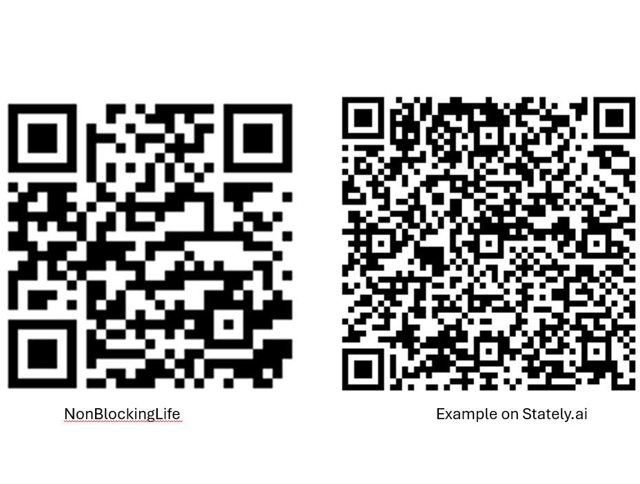

# 短影音稿

0:00 一顆飛行中的球受到非常多的因素影響，但是，當我們將它簡化成一個質點、並且記錄不同時刻所在的位置，科學家甚至因此找到超級簡單的運動方程式。
- [Youtube影片](https://www.youtube.com/watch?v=FjFQvHvhdUY&t=63s) 0:30 處

0:23 同樣的，我們若將我們的生活簡化成一個狀態機，然後紀錄進入與離開不同狀態的時間點與做了甚麼，我們就有機會優化與改進我們的生活。
- [stately.ai](https://stately.ai/registry/editor/9c349b99-4175-4d81-a29f-16287d136c01?machineId=dca5124e-f660-4512-bd10-c88ddeaa4592&mode=Design)

0:35 由於我們在 idle 的時候，有太多的選擇
- 開始 Simulate，然後跑到 Idle

0:40 很容易就像這張能階圖一般，滑向娛樂、壞習慣、壞脾氣等。
- 

0:47 然後，就進入迴圈，結果，有益處的事幾乎都沒做，人生像是被阻塞了。
- 再回到 Simulate，陷入迴圈

0:55 NBL 提出的解決方案，就是請您在每次狀態切換前，簡單地打開NBL一下，給自己一個有意識的暫停與建議。
- 使用 PowerPoint  外加 NBL 跳出來

1:09 在您的心裡，就會像是有個potential barrier一樣，讓您不會那麼容易就滑向壞習慣的能階。
1:18 再加上使用番茄時鐘法則，讓您可以在一段時間內專注在有價值的事上，又可以限制該狀態的時間，
1:38 這樣，就有機會遍歷更多有益處的狀態，讓人生更豐富、更有意義。
- 使用 PowerPoint  的右邊

1:38 這些狀態可以是任務、好習慣養成與壞習慣戒除，甚至是情緒狀態的調整。
- 用 PowerPoint 一個條目一個條目顯現

1:47 隨著時間的演進，您會發覺，專案的能階下降，甚至到了比idle還低，而壞習慣等的能階上升，就算不使用NBL，也不會輕易地滑向壞習慣了。
- 用 PowerPoint 顯示一根根的能階往下掉
- 最後，來個反轉

2:02 一開始您使用 NBL 的時候，裡面只有一些建議的狀態。先試著有 idea 的時候就記錄到 Inbox 裡面。
- NBL 的示範

2:14 當您回到idle時，就點開 candidates看一下，然後每天固定一個時間去清理 Inbox，
把想法變成狀態，這樣就會慢慢地讓NBL裡面的狀態們(或任務)能與您實際人生中的生活與目標對應起來。
- NBL 的示範，從 candidates 到 Inbox，再到狀態機裡面

2:35 若要透過Log分析您的狀態切換的趨勢，並且提出建議的話，請參照sync 的部分，取出Log資訊，然後交由AI來分析。
- 看一下Log，指一下 sync 的部分

2:49 歡迎掃描QR Code，體驗一下NBL與stately上的狀態機演示。謝謝觀賞。
- 
