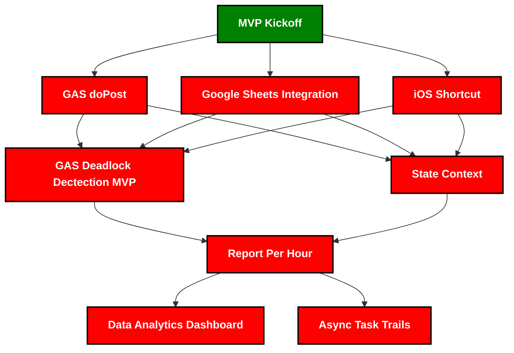

# Dependency Graph

```mermaid
graph TD
    20260114MVP_kickoff["MVP Kickoff"]
    style 20260114MVP_kickoff fill:green,stroke:#333,stroke-width:1px
style 20260114MVP_kickoff fill:green,stroke:#000000,stroke-width:2px,color:#FFFFFF,font-weight:bold
    dev_meta_20260114MVP_DevMeta20260114MVP_gas_doPost["GAS doPost"]
    style dev_meta_20260114MVP_DevMeta20260114MVP_gas_doPost fill:red,stroke:#333,stroke-width:1px
style dev_meta_20260114MVP_DevMeta20260114MVP_gas_doPost fill:red,stroke:#000000,stroke-width:2px,color:#FFFFFF,font-weight:bold
    20260114MVP_kickoff --> dev_meta_20260114MVP_DevMeta20260114MVP_gas_doPost
    dev_meta_20260114MVP_DevMeta20260114MVP_google_sheets_integration["Google Sheets Integration"]
    style dev_meta_20260114MVP_DevMeta20260114MVP_google_sheets_integration fill:red,stroke:#333,stroke-width:1px
style dev_meta_20260114MVP_DevMeta20260114MVP_google_sheets_integration fill:red,stroke:#000000,stroke-width:2px,color:#FFFFFF,font-weight:bold
    20260114MVP_kickoff --> dev_meta_20260114MVP_DevMeta20260114MVP_google_sheets_integration
    dev_meta_20260114MVP_DevMeta20260114MVP_ios_shortcut["iOS Shortcut"]
    style dev_meta_20260114MVP_DevMeta20260114MVP_ios_shortcut fill:red,stroke:#333,stroke-width:1px
style dev_meta_20260114MVP_DevMeta20260114MVP_ios_shortcut fill:red,stroke:#000000,stroke-width:2px,color:#FFFFFF,font-weight:bold
    20260114MVP_kickoff --> dev_meta_20260114MVP_DevMeta20260114MVP_ios_shortcut
    dev_meta_20260114MVP_DevMeta20260114MVP_gas_deadlock_detection["GAS Deadlock Dectection MVP"]
    style dev_meta_20260114MVP_DevMeta20260114MVP_gas_deadlock_detection fill:red,stroke:#333,stroke-width:1px
style dev_meta_20260114MVP_DevMeta20260114MVP_gas_deadlock_detection fill:red,stroke:#000000,stroke-width:2px,color:#FFFFFF,font-weight:bold
    dev_meta_20260114MVP_DevMeta20260114MVP_gas_doPost --> dev_meta_20260114MVP_DevMeta20260114MVP_gas_deadlock_detection
    dev_meta_20260114MVP_DevMeta20260114MVP_google_sheets_integration --> dev_meta_20260114MVP_DevMeta20260114MVP_gas_deadlock_detection
    dev_meta_20260114MVP_DevMeta20260114MVP_ios_shortcut --> dev_meta_20260114MVP_DevMeta20260114MVP_gas_deadlock_detection
    dev_meta_20260114MVP_DevMeta20260114MVP_state_context["State Context"]
    style dev_meta_20260114MVP_DevMeta20260114MVP_state_context fill:red,stroke:#333,stroke-width:1px
style dev_meta_20260114MVP_DevMeta20260114MVP_state_context fill:red,stroke:#000000,stroke-width:2px,color:#FFFFFF,font-weight:bold
    dev_meta_20260114MVP_DevMeta20260114MVP_gas_doPost --> dev_meta_20260114MVP_DevMeta20260114MVP_state_context
    dev_meta_20260114MVP_DevMeta20260114MVP_google_sheets_integration --> dev_meta_20260114MVP_DevMeta20260114MVP_state_context
    dev_meta_20260114MVP_DevMeta20260114MVP_ios_shortcut --> dev_meta_20260114MVP_DevMeta20260114MVP_state_context
    dev_meta_20260114MVP_DevMeta20260114MVP_report_per_hour["Report Per Hour"]
    style dev_meta_20260114MVP_DevMeta20260114MVP_report_per_hour fill:red,stroke:#333,stroke-width:1px
style dev_meta_20260114MVP_DevMeta20260114MVP_report_per_hour fill:red,stroke:#000000,stroke-width:2px,color:#FFFFFF,font-weight:bold
    dev_meta_20260114MVP_DevMeta20260114MVP_gas_deadlock_detection --> dev_meta_20260114MVP_DevMeta20260114MVP_report_per_hour
    dev_meta_20260114MVP_DevMeta20260114MVP_state_context --> dev_meta_20260114MVP_DevMeta20260114MVP_report_per_hour
    dev_meta_20260114MVP_DevMeta20260114MVP_data_analytics_dashboard["Data Analytics Dashboard"]
    style dev_meta_20260114MVP_DevMeta20260114MVP_data_analytics_dashboard fill:red,stroke:#333,stroke-width:1px
style dev_meta_20260114MVP_DevMeta20260114MVP_data_analytics_dashboard fill:red,stroke:#000000,stroke-width:2px,color:#FFFFFF,font-weight:bold
    dev_meta_20260114MVP_DevMeta20260114MVP_report_per_hour --> dev_meta_20260114MVP_DevMeta20260114MVP_data_analytics_dashboard
    dev_meta_20260114MVP_DevMeta20260114MVP_async_task_trails["Async Task Trails"]
    style dev_meta_20260114MVP_DevMeta20260114MVP_async_task_trails fill:red,stroke:#333,stroke-width:1px
style dev_meta_20260114MVP_DevMeta20260114MVP_async_task_trails fill:red,stroke:#000000,stroke-width:2px,color:#FFFFFF,font-weight:bold
    dev_meta_20260114MVP_DevMeta20260114MVP_report_per_hour --> dev_meta_20260114MVP_DevMeta20260114MVP_async_task_trails
```