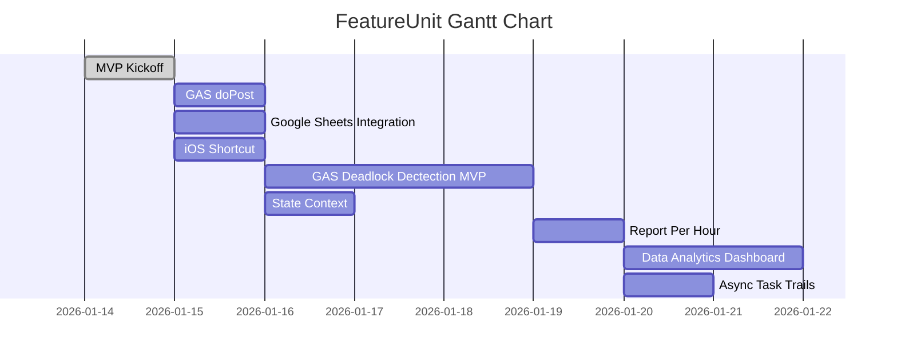
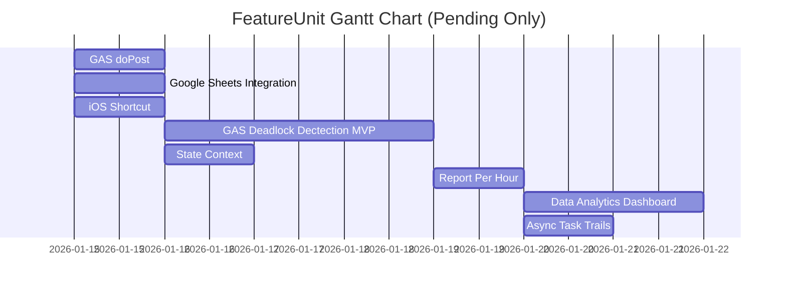

# Gantt Chart

```mermaid
gantt
    title FeatureUnit Gantt Chart
    dateFormat YYYY-MM-DD
    MVP Kickoff : done, 2026-01-14, 2026-01-15
    GAS doPost : pending, 2026-01-15, 2026-01-16
    Google Sheets Integration : pending, 2026-01-15, 2026-01-16
    iOS Shortcut : pending, 2026-01-15, 2026-01-16
    GAS Deadlock Dectection MVP : pending, 2026-01-16, 2026-01-19
    State Context : pending, 2026-01-16, 2026-01-17
    Report Per Hour : pending, 2026-01-19, 2026-01-20
    Data Analytics Dashboard : pending, 2026-01-20, 2026-01-22
    Async Task Trails : pending, 2026-01-20, 2026-01-21
```

# Gantt Chart (Pending Only)

```mermaid
gantt
    title FeatureUnit Gantt Chart (Pending Only)
    dateFormat YYYY-MM-DD
    GAS doPost : pending, 2026-01-15, 2026-01-16
    Google Sheets Integration : pending, 2026-01-15, 2026-01-16
    iOS Shortcut : pending, 2026-01-15, 2026-01-16
    GAS Deadlock Dectection MVP : pending, 2026-01-16, 2026-01-19
    State Context : pending, 2026-01-16, 2026-01-17
    Report Per Hour : pending, 2026-01-19, 2026-01-20
    Data Analytics Dashboard : pending, 2026-01-20, 2026-01-22
    Async Task Trails : pending, 2026-01-20, 2026-01-21
```