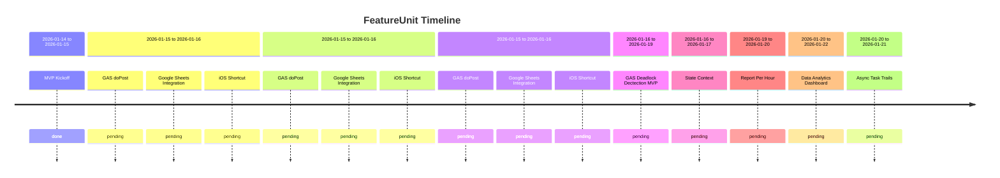
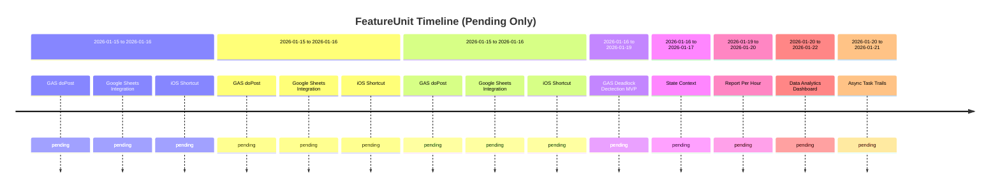

# Timeline

# Timeline

```mermaid
timeline
    title FeatureUnit Timeline
    section 2026-01-14 to 2026-01-15
        MVP Kickoff : done
    section 2026-01-15 to 2026-01-16
        GAS doPost : pending
    section 2026-01-15 to 2026-01-16
        Google Sheets Integration : pending
    section 2026-01-15 to 2026-01-16
        iOS Shortcut : pending
    section 2026-01-16 to 2026-01-19
        GAS Deadlock Dectection MVP : pending
    section 2026-01-16 to 2026-01-17
        State Context : pending
    section 2026-01-19 to 2026-01-20
        Report Per Hour : pending
    section 2026-01-20 to 2026-01-22
        Data Analytics Dashboard : pending
    section 2026-01-20 to 2026-01-21
        Async Task Trails : pending
```

# Timeline (Pending Only)

# Timeline

```mermaid
timeline
    title FeatureUnit Timeline (Pending Only)
    section 2026-01-15 to 2026-01-16
        GAS doPost : pending
    section 2026-01-15 to 2026-01-16
        Google Sheets Integration : pending
    section 2026-01-15 to 2026-01-16
        iOS Shortcut : pending
    section 2026-01-16 to 2026-01-19
        GAS Deadlock Dectection MVP : pending
    section 2026-01-16 to 2026-01-17
        State Context : pending
    section 2026-01-19 to 2026-01-20
        Report Per Hour : pending
    section 2026-01-20 to 2026-01-22
        Data Analytics Dashboard : pending
    section 2026-01-20 to 2026-01-21
        Async Task Trails : pending
```